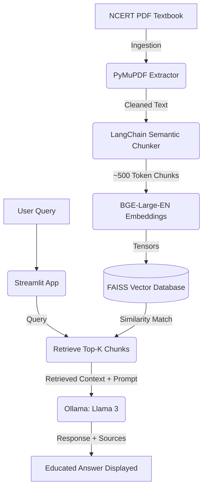

# 📚 NCERT RAG Tutor: Textbook Question Answering

A fully modular Retrieval-Augmented Generation (RAG) system built to parse NCERT textbook PDFs, semantically store their content, and allow robust question answering using local open-source Large Language Models (LLMs) like **Llama 3**. 

This system was designed with **Privacy, Scalability, and Academic Evaluation** at its core.

---

## 🌟 Key Features

1. **Intelligent Document Ingestion:** Uses PyMuPDF to extract text from dense NCERT PDFs while carefully stripping watermarks, headers, and excessive empty space.
2. **Semantic Text Chunking:** Employs recursive chunking algorithms that respect document boundaries (`\n\n`, `\n`, `.`) to prevent definitions and formulas from being sliced in half.
3. **Local Vector Database (FAISS):** Processes massive textbooks using top-tier open-source embedding models (`BAAI/bge-large-en-v1.5`) and caches them instantly using FAISS indices for blisteringly fast retrieval.
4. **Offline Generative AI (Ollama):** The entire Q&A loop can be run 100% locally via Ollama without any data leaving your device. Llama 3 parses the provided context and acts strictly as an expert academic tutor.
5. **Interactive UI:** Interacting with the system is simple via an elegant Streamlit frontend. 
6. **Built-in Evaluation Engine:** Not just a toy! The repository comes with an automated framework to evaluate pipeline changes using **Exact Match**, **Rouge F1 Overlap**, and **Semantic Cosine Similarity** against your own custom Q&A test cases.

---

## 🧱 Architecture Diagram



---

## 📁 Repository Structure

```text
ncert-rag/
│
├── data/
│   ├── raw_pdfs/           # Place your PDF chapters here
│   ├── processed_text/     # Parsed page outputs
│   ├── chunks/             # Post-chunking YAML data
│   ├── vector_db/          # Cached FAISS Indices
│   └── qa_dataset/         # JSON datasets for Evaluation & Tuning
│
├── src/
│   ├── ingestion.py        # PDF extraction & cleaning
│   ├── chunking.py         # Semantic LangChain boundaries
│   ├── embeddings.py       # Auto-downgrading CUDA/CPU Torch model 
│   ├── vector_store.py     # FAISS initialization & searching
│   ├── rag_pipeline.py     # Llama 3 Prompt + Context handling
│   └── evaluation.py       # Metrics execution (F1, EM, Cosine)
│
├── configs/
│   └── config.yaml         # SINGLE SOURCE OF TRUTH for settings
│
├── outputs/
│   └── evaluation_reports/ # Results CSV/JSON
│
├── app.py                  # Streamlit Web Application
├── requirements.txt        # Package dependencies
└── README.md               # You are here
```

---

## 🚀 Installation & Setup

### 1. Prerequisites
Ensure you have Python 3.9+ installed natively.
Install the required pipelines:

```bash
pip install -r requirements.txt
```

### 2. Setup LLM Backend (Ollama)
This project is engineered to work privately using [Ollama](https://ollama.com/). Setup your local API host in a separate terminal:

```bash
# Download the model
ollama pull llama3

# Start the active server (Run in a dedicated terminal!)
ollama run llama3
```

### 3. GPU Constraints Handling
The pipeline is natively orchestrated to use `device: cuda` for high-throughput tensor embeddings. However, if your environment's downloaded PyTorch library does *not* possess the CUDA binaries correctly matching your NVIDIA drivers, the system will **automatically fallback safely to the CPU**!

---

## 💻 Usage Instructions

### Starting the RAG Assistant (Streamlit)
The easiest way to use the system is via the User Interface.

1. Drop your target textbook (e.g., `Science_Chapter_4.pdf`) into `data/raw_pdfs/`.
2. Launch the Streamlit daemon:
```bash
streamlit run app.py
```
3. Open `http://localhost:8501`. Use the sidebar to trigger **Document Processing**, which will automatically construct your FAISS database.
4. Interact freely in the chat room with your "NCERT Tutor"!

---

## 🧪 Evaluation Framework

Testing a RAG is critical to assure it hasn't hallucinated or lost source contexts.

If you generate a synthetic JSON array containing questions and expected answers inside `data/qa_dataset/test_qa.json` mirroring this format:

```json
[
  {
    "question": "What is Dalton's atomic theory?",
    "expected_answer": "Dalton proposed that all matter is made of indivisible particles called atoms..."
  }
]
```

You can programmatically evaluate your RAG configuration:

```python
from src.rag_pipeline import RAGPipeline
from src.evaluation import Evaluator

# Initialize the pipeline loaded with your target vector index 
rag = RAGPipeline(index_name="my_textbook_index")
evaluator = Evaluator(rag)

# Let and watch the metrics aggregate!
metrics = evaluator.run_evaluation(
    test_dataset_path="data/qa_dataset/test_qa.json", 
    output_report_name="report.json"
)
print("Pipeline Score:", metrics)
```

The system will leverage HuggingFace arrays to map out exactly where the bot failed mathematically alongside generating CSV reports for manual inspection.

---

## ⚙️ Configuration (Tuning)

Want bigger chunks? Want to use Qwen 2.5 instead? Want a larger context window? Change it instantly across the ENTIRE system via `configs/config.yaml`.

```yaml
chunking:
  chunk_size: 500      # Increase if models lose concept continuity 
  chunk_overlap: 100

embeddings:
  model_name: "BAAI/bge-large-en-v1.5"

retrieval:
  top_k: 4             # Retrieve 4 chunks at a time

llm:
  provider: "ollama" 
  model_name: "llama3" # Change to "qwen" if installed!
  temperature: 0.1     # Keep low for strict text adherence
```
